# Vehicle-Detection-and-Tracking

------

In this project, the goal is to write a software pipeline to identify vehicles in a video from a front-facing camera on a car.

The goals / steps of this project are the following:

* Perform a Histogram of Oriented Gradients (HOG) feature extraction on a labeled training set of images and train a classifier Linear SVM classifier
* Use color transform and append binned color features, as well as histograms of color, to HOG feature vector. 
* Note: for those first two steps don't forget to normalize your features and randomize a selection for training and testing.
* Implement a sliding-window technique and use your trained classifier to search for vehicles in images.
* Run your pipeline on a video stream (start with the test_video.mp4 and later implement on full project_video.mp4) and create a heat map of recurring detections frame by frame to reject outliers and follow detected vehicles.
* Estimate a bounding box for vehicles detected.

[//]: # (Image References)

[image1](./examples/car_not_car.png)
[image2](./examples/HOG_example.jpg)
[image3](./examples/sliding_windows.jpg)
[image4](./examples/sliding_window.jpg)
[image5](./examples/bboxes_and_heat.png)
[image6](./examples/labels_map.png)
[image7](./examples/output_bboxes.png)

### Histogram of Oriented Gradients (HOG)

#### 1. Extraction of HOG features from the training images.

The code for this step is contained in the function `get_hog_features()` present in `feature_processing.py`. A working example with visualization is present in cell #3 and cell #4 of python notebook.

I started by reading in all the `vehicle` and `non-vehicle` images.  Here is an example of one of each of the `vehicle` and `non-vehicle` classes:

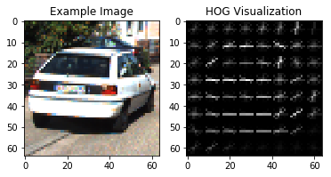

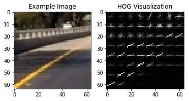

I also explored different color spaces and different `skimage.hog()` parameters (`orientations`, `pixels_per_cell`, and `cells_per_block`).

#### 2. HOG parameters.

I tried various combinations of parameters and finally settle with the below set of hyper-parameters

```
color_space = 'LUV'
orient = 8
pix_per_cell = 8
cell_per_block = 2
hog_channel = 0
spatial_size = (16, 16)
hist_bins = 32
spatial_feat = True
hist_feat = True
hog_feat = True
```

#### 3. Support Vector Classifier training using selected HOG features.
I first generated a feature vector for every training an testing image (cell  #6) and then used these features to train a Linear SVC (in cell #7).

### Sliding Window Search

#### 1. Implemetation, scales and overlap

Cell #8 demostrates the use of methods `slide_window()` and `search_windows()` both present in file `utils.py`. `slide_window()` return a list of bounding boxes for a given set of hyperparameters and `search_windows()` uses bounding boxes and trained Linear SVC to return a set a bounding boxes containing cars.

Important Hyperparamets:
```
xy_window=(128, 128)
xy_overlap=(0.80, 0.80)
scale = {1.20, 1.35, 1.75, 2.0, 2.25, 2.65, 3.0, 3.5, 4.0}
```

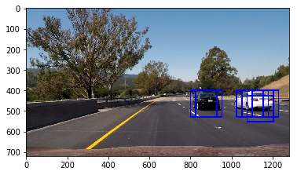

#### 2. Classifier Pipeline

Ultimately I searched on 9 scales using LUV 1-channel HOG features plus spatially binned color and histograms of color in the feature vector, which provided a nice result.  Here are some example images:

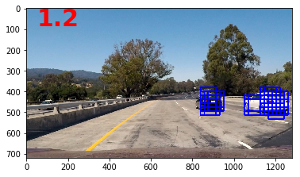
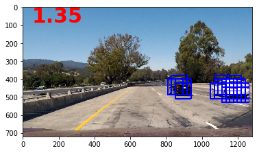
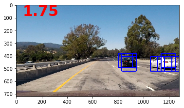
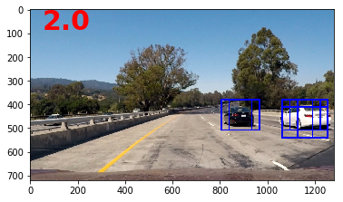


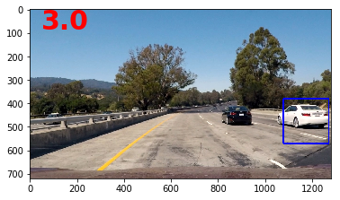
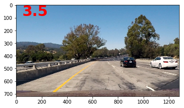


Finally we generate a heat map using the bounding box from all the scales
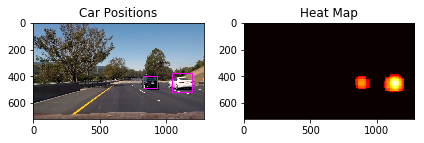

---

### Video Implementation

#### 1. Final video output.
Here's a [link to my video result](./output/videos/project_video.mp4)


#### 2. Hog Sub-sampling Window Search

Next we explore a more efficient method for doing the sliding window approach, one that allows us to only have to extract the Hog features once, . The code is present in function `find_cars()` in the file `utils.py` and it is used in function `get_multipl_scale_bounding_box()` in cell #9. `find_cars()` is able to both extract features and make predictions.

The `find_cars` only has to extract hog features once, for each of a small set of predetermined window sizes (defined by a scale argument), and then can be sub-sampled to get all of its overlaying windows. Each window is defined by a scaling factor that impacts the window size. The scale factor can be set on different regions of the image (e.g. small near the horizon, larger in the center).

For our example are using a 64 x 64 base window. If we define `pixels per cell` as 8 x 8, then a scale of 1 would retain a window that's 8 x 8 cells (8 cells to cover 64 pixels in either direction). An overlap of each window can be defined in terms of the cell distance, using `cells_per_step`. This means that a `cells_per_step = 2` would result in a search window overlap of 75% (2 is 25% of 8, so we move 25% each time, leaving 75% overlap with the previous window). Any value of scale that is larger or smaller than one will scale the base image accordingly, resulting in corresponding change in the number of cells per window. Its possible to run this same function multiple times for different scale values to generate multiple-scaled search windows.

I recorded the positions of positive detections in each frame of the video.  From the positive detections I created a heatmap and then thresholded that map to identify vehicle positions.  I then used `scipy.ndimage.measurements.label()` to identify individual blobs in the heatmap.  I then assumed each blob corresponded to a vehicle.  I constructed bounding boxes to cover the area of each blob detected. 

To further prevent False positive from showing up, I am suming the heat collected in the last 12 frames and then using this summed heatmap we find bounding box.


### Here are six frames and their corresponding heatmaps:

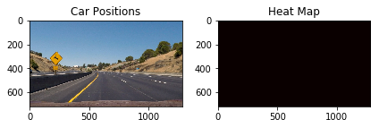
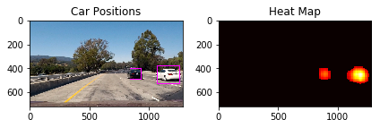

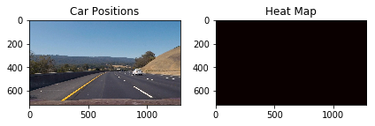
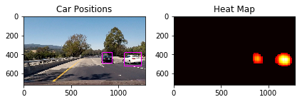
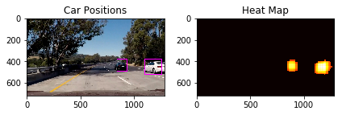

These heat map serve as an average on multiple overlapping bounding boxes.

---

### Future Work

1. Hand engineering of features were required.
2. This pipeline cannot be used in realtime.
3. SVC does a satisfactory job but we can use Object Localization Neural network models 
